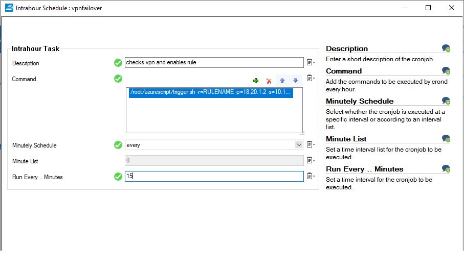

# Barracuda CloudGen Firewall: Updating dynamic objects with the IP aliases of the network interface. 

## Introduction
This project is intended to provide an example of how you can utilise scripts on the Barracuda CloudGen Firewall to update the status of Dynamic Firewall rules. In this example we monitor for the failure of a VPN tunnel and trigger traffic to flow down a different tunnel using a different rule. 

The VPN's in this example do not support BGP routing so failover must happen at the Firewall level.

## Components
Within this project you will find included 2 script files and a example configuration to import into the Barracuda CloudGen Firewall. 

1. trigger.sh - used to trigger the python on the CGF.
2. vpncheck.py - python script that checks VPN's and enables/disables rules

## Workflow

- A scheduled task in the Firewall triggers the trigger.sh script to run.
- The trigger script is used to pass variables into the python script from shell.
- vpncheck.py tests if the "primary" VPN is connected if it isn't it will enable the firewall rule that directs traffic down the secondary VPN. When it detects the Primary VPN is available it will disable the rule sending traffic down the Secondary VPN.

## Installation

1. Two VPN's are required. For example if this was for Zscaler you would have a VPN to the Primary Site "LONDON" and another VPN to the Secondary Site "PARIS". The Local Network for each VPN needs to be a different Network range, we are going to use the Firewall rules to Source NAT the traffic into that range to control the flow of traffic into each tunnel.

2. Create your two Dynamic Firewall rules. This script requires two rules, placed one after another. 
You may name them what you wish and place them anywhere in the ruleset. However the rule to send traffic to the Secondary VPN site must be higher than the rule sending traffic to the Primary VPN.

3. Log into the Firewall via SSH. 

4. Run the following command to create the directory we will place the scripts in.
	`
	mkdir /root/customscript
	`

5. Navigate into the directory
	`
	cd /root/customscript
	`

6. Copy into this folder the trigger.sh and vpncheck.py files.
7. Run the following commands to set the permissions on the files.

	`
	chmod 775 vpncheck.py
	chmod 775 trigger.sh
	`
8. Prepare authentication for the script by issuing the following command to store the password used by the script safely and enable the FW rule for the Primary VPN
	`
	transcmd -p <fwmgmtip> root dynrule enable <yourfwrulename> 0 disable-term
	`
8. In Firewall Admin, go to Advanced, System Scheduler and create a new Intrahour schedule

-m is the management IP of the firewall
-r Rulename that you are going to enable/disable
-p IP address used to establish the primary VPN
-s IP address used to establish the secondary VPN

You must supply all of the above like the example below. 

/root/azurescript/trigger.sh -r="<YOURRULENAME>" -p="<PRIMARYIP>" -s="<SECONDARYIP>" -m="<MGMTIP>"

## Troubleshooting
This script will write logs into /phion0/logs/multi_ip_replace.log

##### DISCLAIMER: ALL OF THE SOURCE CODE ON THIS REPOSITORY IS PROVIDED "AS IS", WITHOUT WARRANTY OF ANY KIND, EXPRESS OR IMPLIED, INCLUDING BUT NOT LIMITED TO THE WARRANTIES OF MERCHANTABILITY, FITNESS FOR A PARTICULAR PURPOSE AND NONINFRINGEMENT. IN NO EVENT SHALL BARRACUDA BE LIABLE FOR ANY CLAIM, DAMAGES, OR OTHER LIABILITY, WHETHER IN AN ACTION OF CONTRACT, TORT OR OTHERWISE, ARISING FROM, OUT OF OR IN CONNECTION WITH THE SOURCE CODE. #####

